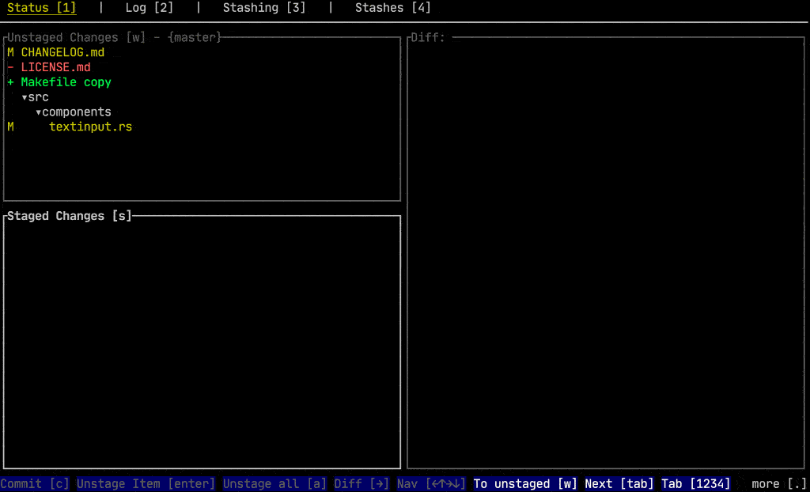

<p align="center">
  
  
</p>

<p align="center">
  <strong>A blazing-fast terminal UI for Git and GitLab</strong><br/>
  Fork of <a href="https://github.com/gitui-org/gitui">gitui</a> — with a native Merge Requests, Issues and CI/CD tab built in
</p>

<p align="center">
  
  
  
</p>

---

## What is labtui?

**labtui** is a keyboard-driven terminal UI that combines full Git workflow support with deep GitLab integration. It lets you review and act on Merge Requests, browse Issues, monitor CI pipelines, and read job logs — all without leaving your terminal or opening a browser.

<p align="center">
  
</p>

---

## Features

### Git (full feature set of the upstream tool)

- Keyboard-only control with context-sensitive help panel
- Stage, unstage, revert and reset — files, hunks, or individual lines
- Commit, amend, with full hook support (`pre-commit`, `commit-msg`, `post-commit`, `prepare-commit-msg`)
- Stash — save, pop, apply, drop, inspect
- Push / Fetch to and from remote
- Branch management — create, rename, delete, checkout, remote tracking
- Browse and search commit log, diff committed changes
- Submodule support
- GPG commit signing
- Async git engine — the UI never freezes

### GitLab (labtui additions)

| Tab | Key | What you can do |
|-----|-----|-----------------|
| **Merge Requests** | `6` | List MRs with live CI badge · open detail + discussion thread · view diff · merge · approve/unapprove · rebase · close/reopen · comment · edit labels · open in browser |
| **Issues** | `7` | List issues · board view by label (switch boards with `[`/`]`) · open detail + comment thread · create · close/reopen · comment · edit labels · filter |
| **CI/CD** | `8` | Browse pipelines → jobs → job trace · retry/cancel pipeline or job · trigger a new pipeline · commits view with per-commit CI status · open in browser |

GitLab tabs appear **automatically** when a GitLab remote is detected. No config file needed.

---

## Build

**Requirements:**

- Rust / Cargo ≥ 1.88 — [Install Rust](https://www.rust-lang.org/tools/install)
- A C compiler and Perl ≥ 5.12 (only if you need the vendored OpenSSL fallback)
- Python (invocable as `python`) — to run the full test suite

```sh
cargo build --release
```

The binary is written to `target/release/labtui`.

> **Tip — link errors with OpenSSL?**  
> Build without the bundled OpenSSL and let Cargo use the system TLS stack (rustls):
>
> ```sh
> cargo build --release --no-default-features
> ```

### Install (local)

```sh
cargo install --path . --locked
```

---

## GitLab setup

labtui reads your repo's git remote URL and auto-detects whether it points to a GitLab instance (gitlab.com or self-hosted).

On first launch in a GitLab repo, you will be prompted to enter a **Personal Access Token**:

- `read_api` scope — read-only browsing (MRs, Issues, CI logs)
- `api` scope — required for write actions (merge, approve, create issue, comment …)

The token is stored in the **OS keyring** (no plain-text files). You can also pass it via environment variable:

```sh
export GITLAB_TOKEN=your_token
```

---

## Usage

```sh
labtui
```

Launch in any git repository. Navigate tabs with `Tab` / `Shift+Tab` or the number keys `1`–`8`.

### Global keys

| Key | Action |
|-----|--------|
| `Tab` / `Shift+Tab` | Next / previous tab |
| `1`–`5` | Git tabs (Status, Log, Files, Stash, Branches) |
| `6` | Merge Requests tab |
| `7` | Issues tab |
| `8` | CI/CD tab |
| `?` | Toggle context-sensitive help |
| `q` | Quit |

### Merge Requests (`6`)

| Key | Action |
|-----|--------|
| `Enter` | Open MR detail + discussion thread |
| `d` | View the diff / changed files |
| `m` | Merge |
| `a` / `u` | Approve / unapprove |
| `b` | Rebase |
| `c` | Close / reopen |
| `n` | Add a comment |
| `l` | Edit labels |
| `o` | Open in browser |
| `f` | Filter (title, branch, author, label) |
| `r` | Refresh |

### Issues (`7`)

| Key | Action |
|-----|--------|
| `Enter` | Open issue detail + discussion thread |
| `n` (list) | Create a new issue |
| `c` | Close / reopen |
| `l` | Edit labels |
| `o` | Open in browser |
| `b` | Toggle board view |
| `[` / `]` | Switch board |
| `←` / `→` | Move between board columns |
| `f` | Filter |
| `r` | Refresh |

### CI/CD (`8`)

| Key | Action |
|-----|--------|
| `Enter` | Drill down — pipelines → jobs → job trace |
| `Esc` | Go back up one level |
| `t` | Retry pipeline or job |
| `x` | Cancel pipeline or job |
| `p` | Run a new pipeline |
| `c` | Toggle commits view |
| `o` | Open in browser |
| `r` | Refresh |

---

## Key Bindings

Key bindings can be customized via a Ron config file. See [KEY_CONFIG.md](KEY_CONFIG.md) for the full reference, including ready-made vim-style bindings.

---

## Color Themes

labtui works on both light and dark terminals and ships with several built-in themes. See [THEMES.md](THEMES.md) for how to switch themes and write your own.

---

## GitLab coverage

See [`asyncgitlab/ROADMAP.md`](asyncgitlab/ROADMAP.md) for the complete coverage matrix (library vs. UI) and the list of upcoming features.

---

## License

MIT — see [LICENSE.md](LICENSE.md).

labtui is a fork of [gitui](https://github.com/gitui-org/gitui) by Stephan Dilly (extrawurst), used under the MIT license.
